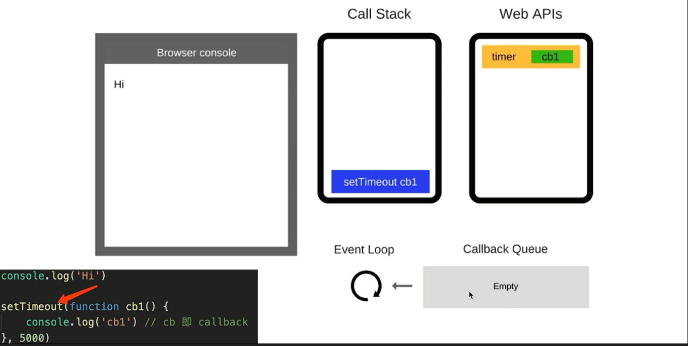
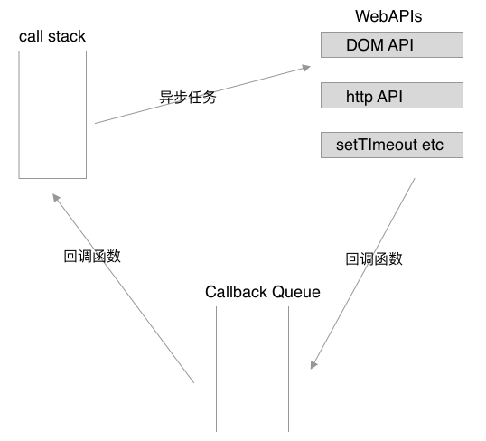
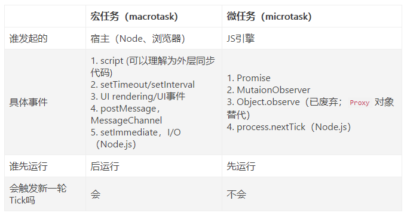

## Event-loop和宏队列、微队列	

​	当被面试官问到**什么是事件循环机制？**很多人会将**事件循环机制**和**宏任务、微任务**揉在一块说，但个人觉得这样不太好。我认为应该先解释**什么是事件循环机制？**，如果面试官继续深入问，我再解释宏任务、微任务以及他们在事件循环机制中充当的角色。

事件循环机制参考：https://zhuanlan.zhihu.com/p/55511602

#### 一、什么是事件循环机制？

event-loop事件循环机制又叫事件轮询机制，是JS的异步回调机制的实现原理。**事件循环机制就是当Call Stack（调用栈）为空时，不断轮询查找Callback Queue（回调队列）中的任务去放到调用栈中执行。**其详细过程如下：

​	

1. JS在执行时，当遇到同步代码的时候就顺序执行，遇到异步代码时，把异步任务抛给Web API执行，然后继续执行接下来的同步代码，直到栈为空。
2. 在步骤1进行的同时，WebAPI执行异步任务，完成一个异步任务就会将对应的回调函数放入回调队列中等待。
3. 当执行栈为空时，就会从回调队列的对头取出任务去执行，然后重复这个过程。

- JS是单线程的
- 异步（setTimeout，ajax等）使用回调函数，基于event-loop
- DOM事件也是使用回调，基于event-loop

关于回调队列可以按此理解：https://blog.csdn.net/weixin_41884153/article/details/90737448?ivk_sa=1024320u

#### 二、宏任务、微任务，以及他们在事件循环机制中是怎样执行的？

​	**宏任务：**script(整体代码)，setTimeout，setInterval，Ajax，DOM事件

​	**微任务：**Promise ，async/await

​	**宏任务是由宿主（浏览器或Node）发起的，微任务是有JavaScript自身发起的。微任务会在宏任务之前先运行。**

**微任务就是一个需要异步执行的函数，执行时机是在主函数执行结束之后、当前宏任务结束之前。**

- 微任务和宏任务是绑定的，每个宏任务在执行时，会创建自己的微任务队列。
- 在一个宏任务中，分别创建一个用于回调的宏任务队列和微任务队列，无论什么情况下，微任务都早于宏任务执行。

##### 加入宏任务和微任务后的event-loop过程：

1. 执行全局的Script同步代码，执行完后调用栈会被清空
2. 从微队列中取出位于队首的回调任务放到调用栈中执行，执行完后再取再执行直到微任务队列为空。如果
   执行过程中又有微任务产生，那么会将这个微任务加入到该队列的队尾，也会在这个周期被调用执行。
3. 取出位于宏队列队首的宏任务，放入调用栈中执行。
4. 重复上述步骤。

