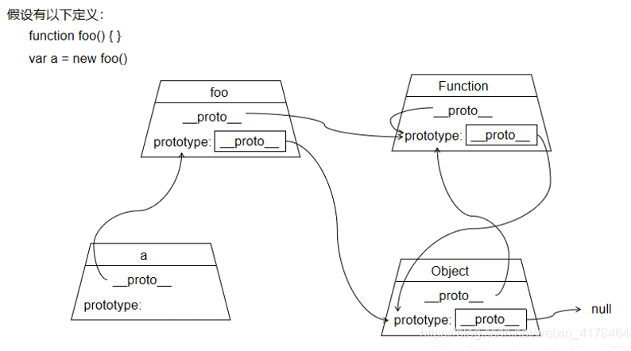

**显示原型**：prototype

- 每个class/函数都有显示原型prototype，它默认指向一个Object空对象（即称为原型对象）
- 原型对象中一个属性constructor，它指向函数对象

**隐式原型**：__proto__

- 每个实例都有隐式原型__proto__
- 实例的__proto__指向对应的class/函数的prototype。

**相关概念**：

1. Function是所有函数(function)的父亲，所有函数都是它的实例。
2. Object也是一个函数，所以Object是Function的实例对象。
3. 任何对象的原型链顶端最终都指向Object.prototype,Object.prototype再往上已经没有东西了，所以指向null。
4. Function比较特殊它的原型指向自己，即Function.__proto__ === Function.prototype。
5. 同时，Function是对象，由(3)可知Function必然有一个地方（即Function.prototype.__proto__）指向Object.prototype。

**先来看一个简化版的原型链图：**

再来看一个完整版的：

总之，记住一句话：A是B的实例，则A.__ proto __  === B.prototype；只要A是对象，那么A.prototype.__ proto__ 就指向Object.prototype；prototype中的constructor指向的是自己；

https://blog.csdn.net/weixin_41784648/article/details/108252962?spm=1001.2014.3001.5501